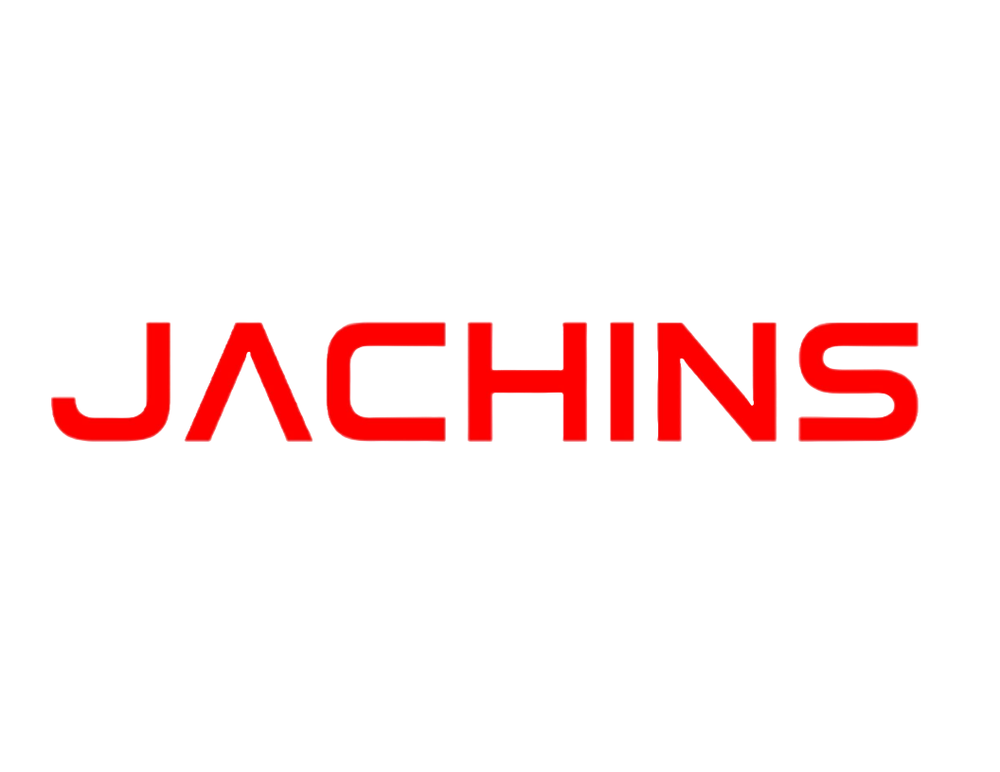

# JACHINS Development Limited Website



## Overview

The JACHINS Development Limited website is the official corporate website showcasing the company's expertise in engineering, procurement, construction, marine logistics, manpower outsourcing, inspection, and project support services across Nigeria's oil & gas and energy sectors.

The website was redesigned with a modern, responsive interface focused on performance, accessibility, SEO, and an improved user experience.

---

## Features

- Modern responsive design
- Mobile-first layout
- Corporate branding
- Smooth animations (AOS)
- Interactive service pages
- Projects portfolio
- Licenses & Certifications section
- Contact form
- Google Maps integration
- SEO optimized pages
- Fast loading assets
- Cross-browser compatibility

---

## Technology Stack

### Frontend

- HTML5
- CSS3
- Bootstrap 5
- JavaScript (ES6)
- jQuery

### Libraries

- AOS (Animate On Scroll)
- Swiper.js
- Font Awesome
- Owl Carousel (if applicable)

---

## Website Structure

```
/
├── index.html
├── about.html
├── services.html
├── projects.html
├── licenses.html
├── careers.html
├── contact.html
│
├── assets/
│   ├── css/
│   ├── js/
│   ├── images/
│   ├── fonts/
│   └── vendor/
│
├── forms/
│   └── contact.php
│
└── README.md
```

---

## Core Pages

- Home
- About Us
- Services
- Projects
- HSE
- CSR
- Contact

---

## Services Highlight

- Engineering Services
- Procurement
- Construction
- Marine Logistics
- Manpower Supply
- Equipment Leasing
- Inspection Services
- Project Management
- Asset Integrity
- Maintenance Support

---

## Industries Served

- Oil & Gas
- Energy
- Marine
- Infrastructure
- Construction
- Government
- Industrial Facilities

---

## Performance Goals

- Lighthouse Score 90+
- Mobile Optimized
- SEO Friendly
- WCAG Accessibility
- Optimized Images
- Lazy Loading
- Minified Assets

---

## Deployment

This website can be deployed using:

- Vercel
- Netlify
- cPanel
- Apache
- Nginx

---

## Local Development

Clone the repository

```bash
git clone https://github.com/yourusername/jachins-website.git
```

Navigate into the project

```bash
cd jachins-website
```

Open with your preferred development environment.

If PHP is required:

```bash
php -S localhost:8000
```

Visit

```
http://localhost:8000
```

---

## Contact Form

The contact form uses PHP for processing.

Ensure:

- PHP Mail is configured

or

- SMTP (recommended via PHPMailer)

---

## SEO

Implemented:

- Semantic HTML
- Meta Titles
- Meta Descriptions
- Open Graph Tags
- Twitter Cards
- Structured Data
- Sitemap
- Robots.txt

---

## Browser Support

- Chrome
- Edge
- Firefox
- Safari
- Opera

---

## Project Goals

- Strengthen JACHINS online presence
- Showcase engineering expertise
- Improve client engagement
- Generate qualified business enquiries
- Present a modern corporate identity

---

## Future Improvements

- CMS Integration
- Project Management Dashboard
- Client Portal
- Employee Portal
- Online Recruitment
- Blog
- Multi-language Support
- Live Chat
- AI Assistant

---

## Developed By

**JACHINS Development Limited**

Website:
https://jachinsgroup.com

Email:
info@jachinsgroup.com

---

## Version

Current Version

```
v2.0.0
```

Release

```
July 2026
```

---

## License

Copyright © 2026 JACHINS Development Limited.

All Rights Reserved.
